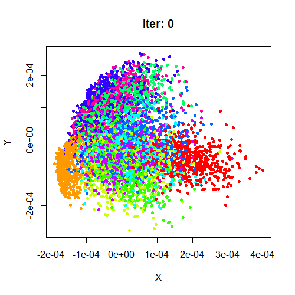

# rtsne

A fork of Justin Donaldson's R package for [t-SNE](https://lvdmaaten.github.io/tsne/) 
(t-Distributed Stochastic Neighbor Embedding).

I just wanted to teach myself how t-SNE worked, while also learning non-trivial 
and idiomatic R programming. I have subsequently messed about with various
parameters, exposing different options, and also added:

* Extra initialization option: use the first two PCA scores. Makes embedding deterministic. 
This can be scaled so the standard deviation is 1e-4 (as in the usual random initialization).
* Early exaggeration option: the method suggested by [Linderman and Steinerberger](https://arxiv.org/abs/1706.02582).
* Extra scaling options.
* Changed some of the perplexity-calibration code to make it a bit faster.
* Return more information (like the [Rtsne](https://cran.r-project.org/package=Rtsne) package)
 by setting `ret_extra = TRUE`.
* Exposed some extra parameters, using the same names as the Rtsne interface.
* Various minor quality of life improvements.

## Installing:

```R
install.packages("devtools")
devtools::install_github("jlmelville/rtsne/tsne")
library(tsne)
```

## Using:

```R
uniq_spec <- unique(iris$Species)
colors <- rainbow(length(uniq_spec))
names(colors) <- uniq_spec
iris_plot <- function(x) {
  plot(x, col = colors[iris$Species])
}

# By default, we use all numeric columns found in a data frame, so you don't
# need to filter out factor or strings
tsne_iris <- tsne(iris, perplexity = 25, epoch_callback = iris_plot)

# set verbose = TRUE to log progress to the console
tsne_iris <- tsne(iris, perplexity = 25, epoch_callback = iris_plot, verbose = TRUE)

# use (scaled) PCA initialization so embedding is repeatable
tsne_iris_spca <- tsne(iris, perplexity = 25, epoch_callback = iris_plot, Y_init = "spca")

# scale each input column to unit variance and zero mean
tsne_iris_scale <- tsne(iris, perplexity = 25, epoch_callback = iris_plot, scale = TRUE, Y_init = "spca")

# whitening
tsne_iris_whiten <- tsne(iris, perplexity = 25, epoch_callback = iris_plot, whiten = TRUE)

# dataset-dependent exaggeration suggested by Linderman and Steinerberger
tsne_iris_ls <- tsne(iris, perplexity = 25, epoch_callback = iris_plot, exaggeration_factor = "ls")

# return extra information in a list, like with Rtsne
tsne_iris_extra <- tsne(iris, perplexity = 25, epoch_callback = iris_plot, ret_extra = TRUE)

# more (potentially large and expensive to calculate) return values, but you 
# have to ask for them specifically
tsne_iris_extra_extra <- tsne(iris, perplexity = 25, epoch_callback = iris_plot, 
                              ret_extra = c("P", "Q", "DX", "DY", "X"))
                          
# Repeat embedding 10 times and keep the one with the best cost
tsne_iris_best <- tsne_rep(nrep = 10, iris, perplexity = 25, epoch_callback = iris_plot, ret_extra = TRUE)
```

## MNIST example

This example follows that given in the original [t-SNE paper](http://jmlr.org/papers/v9/vandermaaten08a.html), 
sampling 6,000 digits from the [MNIST database of handwritten digits](http://yann.lecun.com/exdb/mnist/)
(via my [snedata package](https://github.com/jlmelville/snedata)).

The parameters for the embedding are those given in the paper. For the PCA
preprocessing carried out to reduce the input data to 30 dimensions, no 
scaling of the columns is carried out (each column *is* centered, however);
it's not mentioned in the paper if any scaling is done as part of the PCA.

Also, no specific scaling of the data is mentioned in the paper as part of the
input processing, before the perplexity calibration is carried out. The example
below range scales the (PCA preprocessed data) between 0 and 1 over the entire
matrix.

Finally, rather than random initialization, the scaled PCA initialization is 
used, which takes the first two score vectors and then scales them to give a
standard deviation of 1e-4.

For visualization of the embedding progress, I used my 
[vizier package](https://github.com/jlmelville/vizier).

```R
# Download MNIST
devtools::install_github("jlmelville/snedata")
mnist <- snedata::download_mnist()

# Sample 6,000 images using dplyr and magrittr to get 600 images per digit
# install.packages(c("dpylr", "magrittr"))
library("dplyr")
library("magrittr")
mnist6k <- sample_n(mnist %>% group_by(Label), 600)

# Reduce input dimensionality from 784 to 30 via PCA
mnist6k_pca30 <- prcomp(mnist6k[, -785], retx = TRUE, rank. = 30)$x

# Use vizier package for visualization
devtools::install_github("jlmelville/vizier")
library(vizier)
tsne_cb <- function(df) {
  function(Y, iter, cost = NULL) {
    title <- paste0("iter: ", iter)
    if (!is.null(cost)) {
      title <- paste0(title, " cost = ", formatC(cost))
    }
    embed_plot(Y, df, title = title)
  }
}

# If you don't care about seeing the iteration number and cost, you can just use:
mnist6k_cb <- function(Y) { embed_plot(Y, mnist6k) }

mnist6k_tsne <- tsne(mnist6k_pca30, scale = "range", Y_init = "spca", perplexity = 40, 
                     exaggeration_factor = 4, stop_lying_iter = 100, eta = 100, max_iter = 1000,
                     epoch_callback = tsne_cb(mnist6k), ret_extra = TRUE, verbose = TRUE)
```



On my Sandy Bridge-era Windows laptop, this took about 80 minutes to complete 
(the perplexity  calibration only took about 2 of those minutes) and seemed to 
add about 2.5 GB of RAM onto my R session.

## License

[GPLv2 or later](https://www.gnu.org/licenses/gpl-2.0.txt).
